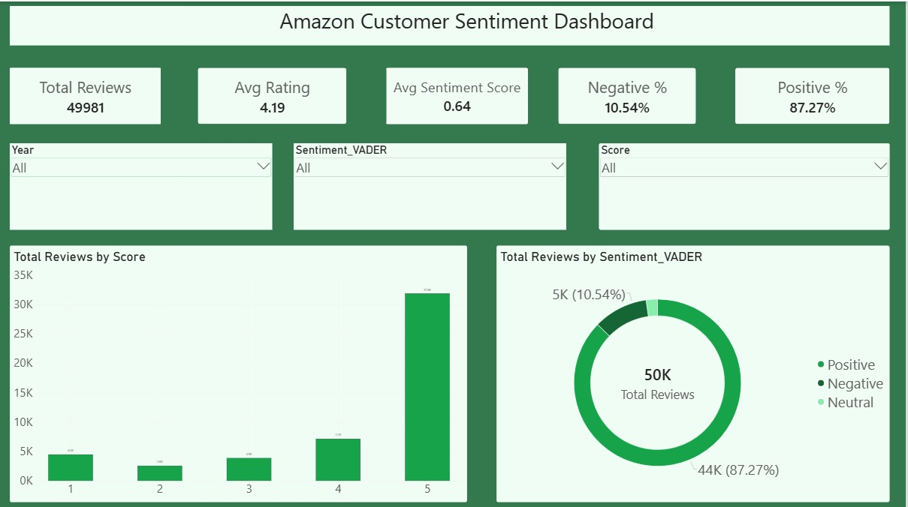
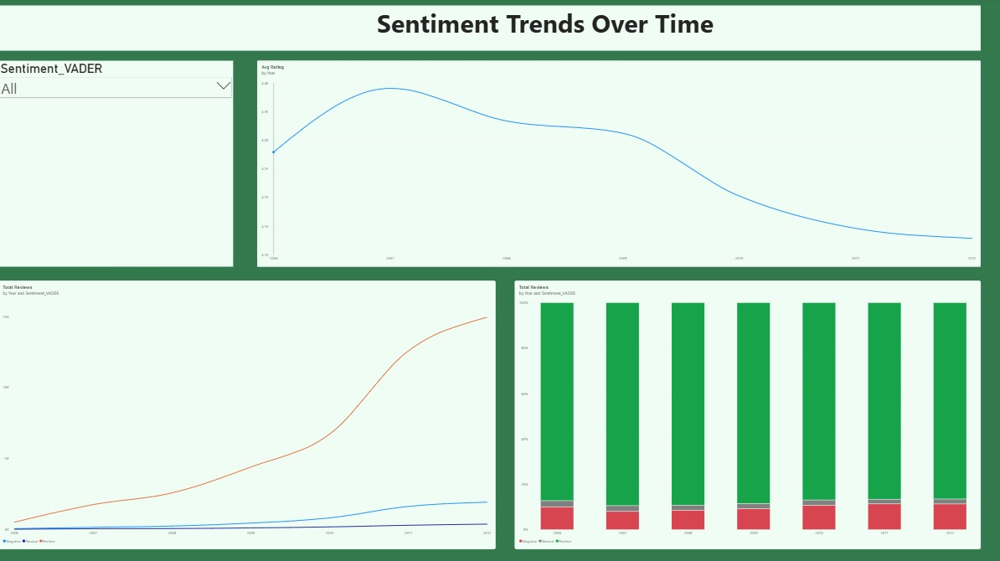
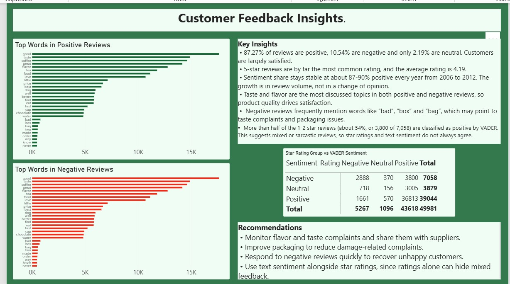

# Amazon Customers Sentiment Analysis

An interactive **Power BI dashboard** that analyses **49,981 Amazon customer reviews** using **VADER sentiment analysis** to understand customer satisfaction, sentiment trends and the topics customers talk about most.

> **Syntexhub Internship, Task 4** | Created by **Rani Rai**

---

## Project Overview

Reading thousands of reviews by hand is not practical. This project turns free-text reviews into measurable signals:

- Each review is scored with VADER and labelled **Positive**, **Negative** or **Neutral**.
- Star ratings are compared with text sentiment to find where they disagree.
- A three-page dashboard presents the results with filters for **Year**, **Sentiment** and **Score**.

## Dashboard Preview

### 1. Overview
Headline KPIs, total reviews by score and the overall sentiment split.

### 2. Trends
How ratings, review volume and sentiment change from 2006 to 2012.

### 3. Insights
Top words in positive and negative reviews, star rating vs VADER comparison, key insights and recommendations.

## Key Metrics

| Metric | Value |
| --- | --- |
| Total Reviews | 49,981 |
| Average Rating | 4.19 |
| Average Sentiment Score | 0.64 |
| Positive Reviews | 87.27% |
| Negative Reviews | 10.54% |
| Neutral Reviews | 2.19% |

## Key Findings

- **Customers are largely satisfied.** 87.27% of reviews are positive and 5-star reviews are by far the most common.
- **Sentiment is stable over time.** About 87% to 90% of reviews are positive every year from 2006 to 2012. The growth is in review volume, not in a change of opinion.
- **Product quality drives satisfaction.** Taste and flavour are the most discussed topics in both positive and negative reviews.
- **Complaints point to packaging.** Negative reviews often mention words like "bad", "box" and "bag".
- **Ratings and text can disagree.** About 54% of 1-2 star reviews (3,800 of 7,058) are classified as positive by VADER, which suggests mixed or sarcastic reviews.

## Recommendations

- Monitor flavour and taste complaints and share them with suppliers.
- Improve packaging to reduce damage-related complaints.
- Respond to negative reviews quickly to recover unhappy customers.
- Use text sentiment alongside star ratings, since ratings alone can hide mixed feedback.

## Tools and Technologies

| Tool | Purpose |
| --- | --- |
| Python (Jupyter Notebook) | Data preparation and VADER sentiment scoring |
| VADER | Sentiment scoring of review text |
| Microsoft Power BI Desktop | Dashboard, slicers and visuals |
| DAX | Measures such as Total Reviews, Positive % and Negative % |

## Methodology

1. Load and clean the review data (create Year, Month and YearMonth fields).
2. Apply VADER to the review text to get a sentiment score and label.
3. Group star ratings into Positive, Neutral and Negative to compare with VADER.
4. Build a `Top_words` table with the most frequent words in positive and negative reviews.
5. Create DAX measures for the KPIs in Power BI.
6. Design three dashboard pages with slicers for Year, Sentiment_VADER and Score.

## Repository Files

| File | Description |
| --- | --- |
| `Amazon Customers Sentiment Analysis.pbix` | Power BI dashboard file |
| `Amazon_Sentiment_Analysis.ipynb` | Jupyter notebook with the analysis |
| `Amazon_Sentiment_Analysis_Report.pdf` | Full project report |
| `overview.jpeg`, `trends.jpeg`, `insights.jpeg` | Dashboard screenshots |

## How to Use

1. Download or clone this repository.
2. Install [Power BI Desktop](https://powerbi.microsoft.com/desktop/) (free, Windows).
3. Open `Amazon Customers Sentiment Analysis.pbix` to explore the three dashboard pages.
4. Open the `.ipynb` notebook in Jupyter or Google Colab to see the analysis steps.

## Limitations

- VADER is lexicon-based, so it can misread sarcasm and mixed reviews.
- The data covers 2006 to 2012 only, so it may not reflect current customer behaviour.

## Future Scope

- Use machine-learning classifiers to improve accuracy on sarcastic reviews.
- Add topic modelling to group complaints automatically.
- Refresh the dashboard with newer review data.

## Author

**Rani Rai**
Syntexhub Internship, Task 4
